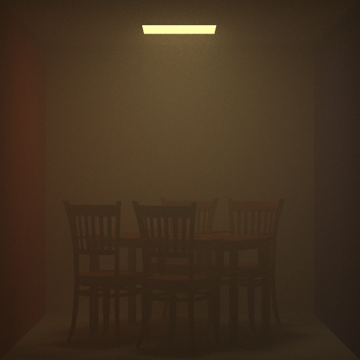

# Tracer
My offscreen rendering lab based on PBRT

## Features
### Renderer
- [ ] Whitted
- [ ] DirectLighting
- [x] Path
- [x] BDPT
- [ ] MLT
- [ ] AO

### Material
- [x] Phong
- [x] Glass
- [x] Homogeneous/heterogeneous medium
- [ ] Metal
- [ ] Plastic
- [ ] Substrate?
- [ ] Disney
- [ ] Volume

### Light
- [x] Diffuse
- [x] IBL
- [ ] Spot
- [ ] Point
### Others
- [x] SAH based BVH
- [x] Depth of field
- [x] Film filter
- [x] Multiple importance sampling
- [x] Tone mapping
- [ ] BSSRDF
- [ ] SIMD
- [ ] Display
## Screenshot
Veach

Cornell-box

Cornell-box with fog

bedroom

dinningroom

Cornell-box2

